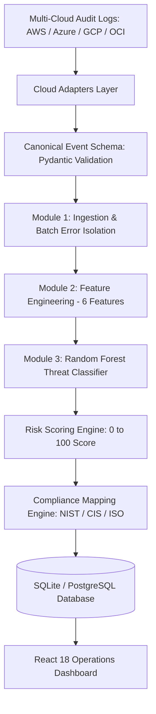

# Multi-Cloud Security Risk Evaluation Framework

An automated multi-cloud security analysis platform that ingests, validates, and normalizes audit telemetry across AWS, Microsoft Azure, Google Cloud Platform (GCP), and Oracle Cloud Infrastructure (OCI). The system evaluates security threats using a trained Random Forest classifier, computes deterministic risk scores (0 to 100), and outputs compliance remediation mappings for NIST CSF 2.0, CIS Controls v8, and ISO/IEC 27001:2022.

---

## 1. Quick Start

The platform runs locally on Windows without requiring external cloud accounts or paid third-party dependencies:

1. **Start System**: Double-click [START_PROJECT.bat](file:///c:/Users/Windows/Documents/cloud/START_PROJECT.bat)
   - Checks Python 3.10+ and Node.js 18+ environments
   - Releases ports 8000 and 5173 if occupied
   - Launches Backend API at http://127.0.0.1:8000
   - Launches Frontend Console at http://127.0.0.1:5173
   - Validates service health and opens default web browser
2. **Stop System**: Double-click [STOP_PROJECT.bat](file:///c:/Users/Windows/Documents/cloud/STOP_PROJECT.bat)
3. **Restart System**: Double-click [RESTART_PROJECT.bat](file:///c:/Users/Windows/Documents/cloud/RESTART_PROJECT.bat)

---

## 2. System Architecture



---

## 3. Project Documentation Index

The complete documentation suite is organized in the `docs/` directory:

### Architecture and Core Modules
- [01. Project Overview](file:///c:/Users/Windows/Documents/cloud/docs/01_PROJECT_OVERVIEW.md): Problem definition, research objectives, and module scopes.
- [02. System Architecture](file:///c:/Users/Windows/Documents/cloud/docs/02_SYSTEM_ARCHITECTURE.md): Multi-tier architecture, component communication, and data boundaries.
- [03. Core Modules](file:///c:/Users/Windows/Documents/cloud/docs/03_CORE_MODULES.md): Detailed specifications for Modules 1, 2, and 3.
- [04. Data Pipeline](file:///c:/Users/Windows/Documents/cloud/docs/04_DATA_PIPELINE.md): Canonical Event Schema definition and cloud log mapping rules.
- [05. ML and Risk Engine](file:///c:/Users/Windows/Documents/cloud/docs/05_ML_AND_RISK_ENGINE.md): Classifier training, feature engineering, and risk scoring equations.
- [06. Multi-Cloud Architecture](file:///c:/Users/Windows/Documents/cloud/docs/06_MULTI_CLOUD_ARCHITECTURE.md): Adapter pattern interface and lifecycle state machine.

### Cloud Integration Guides
- [07. AWS Setup](file:///c:/Users/Windows/Documents/cloud/docs/07_AWS_SETUP.md): IAM read-only policies, STS identity validation, and CloudTrail ingestion.
- [08. Azure Setup](file:///c:/Users/Windows/Documents/cloud/docs/08_AZURE_SETUP.md): Microsoft Entra ID app registration and Activity Log processing.
- [09. GCP Setup](file:///c:/Users/Windows/Documents/cloud/docs/09_GCP_SETUP.md): Service account key configuration and Cloud Audit Log ingestion.
- [10. OCI Setup](file:///c:/Users/Windows/Documents/cloud/docs/10_OCI_SETUP.md): Oracle Cloud Guard integration and verified Demo Mode stream.
- [Cloud Provider Setup and Usage Audit](file:///c:/Users/Windows/Documents/cloud/docs/CLOUD_PROVIDER_SETUP_AND_USAGE_AUDIT.md): Comprehensive cloud provider audit, environment variables analysis, step-by-step setup, and demonstration workflow.
- [Cloud Event Collection Audit](file:///c:/Users/Windows/Documents/cloud/docs/CLOUD_EVENT_COLLECTION_AUDIT.md): Source-code audit of event collection, live execution results, and telemetry generation instructions.
- [Real Telemetry and Cloud Integration Guide](file:///c:/Users/Windows/Documents/cloud/docs/REAL_TELEMETRY_AND_CLOUD_INTEGRATION.md): Architecture specifications for real cloud event ingestion, sliding-window rate limiting, deduplication, and source mode tagging.

### Security, Authentication, and Tiers
- [11. Credential Security](file:///c:/Users/Windows/Documents/cloud/docs/11_CREDENTIAL_SECURITY.md): Secrets isolation, ignore rules, and zero-leakage policies.
- [12. Authentication and RBAC](file:///c:/Users/Windows/Documents/cloud/docs/12_AUTHENTICATION_AND_RBAC.md): User roles (ADMIN, ANALYST, USER) and route-level protection.
- [13. Free and Pro Features](file:///c:/Users/Windows/Documents/cloud/docs/13_FREE_PRO_FEATURES.md): Tier boundaries, access control, and upgrade workflows.
- [14. Billing](file:///c:/Users/Windows/Documents/cloud/docs/14_BILLING.md): Cryptographic HMAC-SHA256 checkout simulation and webhook verification.

### Operations and UI
- [15. Real-Time Processing](file:///c:/Users/Windows/Documents/cloud/docs/15_REAL_TIME_PROCESSING.md): Continuous event simulation and live provider synchronization.
- [16. Demo Mode](file:///c:/Users/Windows/Documents/cloud/docs/16_DEMO_MODE.md): Deterministic test scenarios for brute-force, unauthorized access, and normal events.
- [17. Dashboard and UI](file:///c:/Users/Windows/Documents/cloud/docs/17_DASHBOARD_AND_UI.md): Operations console layout, metrics ribbon, and deep event inspector.
- [18. API Documentation](file:///c:/Users/Windows/Documents/cloud/docs/18_API_DOCUMENTATION.md): FastAPI REST endpoints, request schemas, and response formats.
- [19. Database](file:///c:/Users/Windows/Documents/cloud/docs/19_DATABASE.md): Schema definitions, entity relationships, and automated SQLite migrations.
- [20. Security Posture](file:///c:/Users/Windows/Documents/cloud/docs/20_SECURITY.md): Vulnerability analysis, input validation, and defensive mitigations.

### Verification and Project Management
- [21. Testing and Validation](file:///c:/Users/Windows/Documents/cloud/docs/21_TESTING_AND_VALIDATION.md): Automated pytest suite coverage and frontend build validation.
- [22. Git and GitHub Guidelines](file:///c:/Users/Windows/Documents/cloud/docs/22_GIT_AND_GITHUB.md): Repository hygiene, pre-commit checklist, and secret protection.
- [23. Deployment](file:///c:/Users/Windows/Documents/cloud/docs/23_DEPLOYMENT.md): Local execution parameters and production containerization.
- [24. Run Guide](file:///c:/Users/Windows/Documents/cloud/docs/24_RUN_GUIDE.md): Execution reference for Windows batch scripts.
- [25. Troubleshooting](file:///c:/Users/Windows/Documents/cloud/docs/25_TROUBLESHOOTING.md): Common error resolutions for ports, dependencies, and credentials.
- [26. Implementation Status](file:///c:/Users/Windows/Documents/cloud/docs/26_IMPLEMENTATION_STATUS.md): Single source of truth implementation matrix.
- [27. Presentation Guide](file:///c:/Users/Windows/Documents/cloud/docs/27_PRESENTATION_GUIDE.md): Structured 5 to 8 minute demonstration script for academic evaluation.
- [Academic Evaluation and Defense Package](file:///c:/Users/Windows/Documents/cloud/docs/ACADEMIC_EVALUATION_AND_DEFENSE_PACKAGE.md): Complete academic viva package containing architecture, ML justification, risk formulations, 20+ viva questions, and defense strategies.

---

## 4. Automated Testing

Run the automated test suite with pytest:

```bash
pytest tests/
```

Test Results: 28 passed, 0 failed across cloud adapters, pipeline stages, rate limiting, and REST endpoints.
