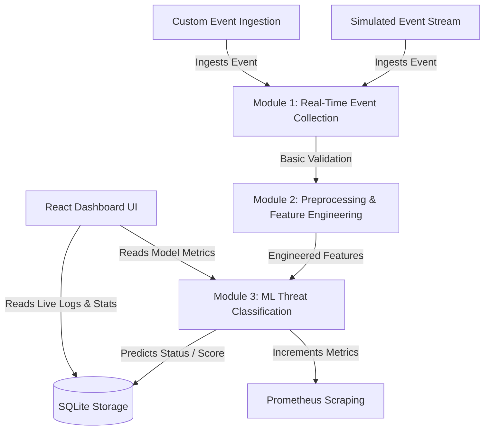

# Generative AI-Powered Cloud Security Assistant for Real-Time Threat Analysis

An intelligent cloud security operations assistant implementing real-time event validation, feature preprocessing, and machine learning threat detection. Developed for academic Project Review II.

---

## 1. System Architecture

The following diagram illustrates the flow of events from the simulated stream (or direct ingest API) through Modules 1, 2, and 3:



---

## 2. Supported Attack Scenarios

To prevent scope creep, the machine learning classifier is configured for two specific scenarios:
1. **Scenario A: Brute-Force Console Login**
   * *Signature*: High count of `failed_attempts` on the `cloud_console` resource.
2. **Scenario B: Unauthorized / Abnormal Resource Access**
   * *Signature*: High request frequency (`request_frequency`) or accesses to sensitive resources (`s3_bucket_finance`, `ec2_admin_portal`) from unusual locations (`CN`, `RU`, `KP`, `UNKNOWN`).

---

## 3. Project Structure

```
c:/Users/Windows/Documents/cloud/
├── data/
│   ├── raw/
│   │   ├── security_events.csv        # Random Forest training data
│   │   └── security_events_eval.csv   # Random Forest evaluation data
│   └── generate_data.py               # Simulated dataset generator script
│
├── backend/
│   ├── app/
│   │   ├── main.py                    # FastAPI server entry point
│   │   ├── db.py                      # SQLite/SQLAlchemy schema configuration
│   │   ├── modules/
│   │   │   ├── module1_event_collection.py  # Ingestion validation
│   │   │   ├── module2_preprocessing.py     # Feature engineering
│   │   │   ├── module3_threat_detection.py  # Random Forest inference/train
│   │   │   ├── module4_rag.py               # Placeholder
│   │   │   ├── module5_llm_analysis.py      # Placeholder
│   │   │   └── module6_risk_response.py     # Placeholder
│   │   └── models/
│   │       ├── threat_detector.joblib       # Trained model parameters
│   │       └── model_metrics.joblib         # Model training statistics
│   └── requirements.txt               # Backend dependencies
│
├── frontend/
│   ├── src/
│   │   ├── App.jsx                    # React Threat Control dashboard
│   │   └── index.css                  # Dark glassmorphic styles
│   └── package.json                   # UI package dependencies
│
├── docs/
│   └── event_schema.md                # Shared Event Schema documentation
│
└── tests/
    └── test_pipeline.py               # Automated unit & integration tests
```

---

## 4. Installation & Local Setup

### Prerequisite: Node.js (v18+) and Python (v3.11+)

### Step 1: Run Data Generator
Initialize the simulated datasets:
```powershell
python .\data\generate_data.py
```

### Step 2: Configure & Start Backend
1. Open a PowerShell terminal in `backend/`:
   ```powershell
   cd backend
   python -m venv venv
   .\venv\Scripts\activate
   pip install -r requirements.txt
   ```
2. Start the FastAPI server (runs on `http://localhost:8000`):
   ```powershell
   .\venv\Scripts\python.exe -m uvicorn app.main:app --host 0.0.0.0 --port 8000 --reload
   ```

### Step 3: Start Frontend Dashboard
1. Open a new PowerShell terminal in `frontend/`:
   ```powershell
   cd frontend
   npm install
   npm run dev
   ```
2. Open the URL printed in the console (usually `http://localhost:5173` or `http://localhost:3000`) in your browser.

---

## 5. Running Tests

To run the full unit and integration test suite:
```powershell
.\backend\venv\Scripts\python.exe -m pytest
```

---

## 6. How to Run the Demo Pipeline

1. **Model Initialization**: Go to the **Random Forest Evaluation** tab in the UI and click **Train Model Now** (or **Trigger Model Train**). This trains the Random Forest classifier and fetches real metrics (Accuracy, F1-score) and feature importances to populate the graphs.
2. **Launch Stream**: Go to the **Real-Time Threat Console** tab and click **Simulate Stream**. The backend will feed one event every 3 seconds from the evaluation dataset, showing:
   * Event ID, timestamp, and metadata in the **Live Event Stream**.
   * The raw values ingested (Module 1) compared side-by-side with numeric/binary variables (Module 2).
   * The verdict classification name, confidence percentage, and list of diagnostic explanations (Module 3).
3. **Custom Injection**: Go to the **Inject Custom Logs** tab, select attributes (e.g. `failed_attempts` = 12, `resource` = `cloud_console`), and click **Inject Event**. This immediate alert will display in the console feed under the threat tag.

---

## 7. Known Limitations

* **Simulated Environment**: The log stream is simulated using realistic synthetic distributions to bypass complex cloud networking configs.
* **Scope Restriction**: The system is designed to classify brute force logins and abnormal resource accesses. It does not replace AWS GuardDuty or GCP Security Command Center, but rather complements them by offering downstream explainability.
* **Modules 4–6**: Modules related to RAG (Module 4), LLM Analysis (Module 5), and Response Automation (Module 6) are stub placeholders and will be integrated in subsequent semesters.
