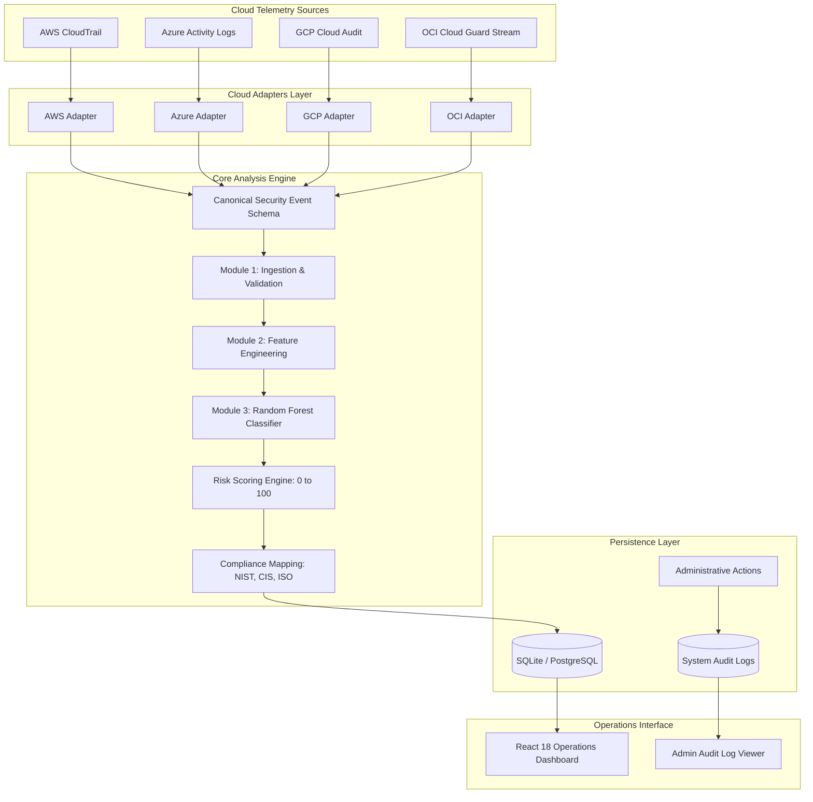

# 02. System Architecture

## Purpose
This document describes the multi-tier system architecture, component boundaries, and data flow between cloud adapters, the core security pipeline, the persistence layer, and the user interface.

## System Architecture

## Architectural Layers

### 1. Cloud Adapters Layer (`backend/app/adapters/`)
All cloud provider connectors inherit from the abstract class `BaseCloudAdapter`. This guarantees a uniform interface across all providers:
- `connect()`: Initializes cloud clients using environment variables or service account files.
- `validate_credentials()`: Verifies authentication against the cloud provider without exposing secret tokens.
- `get_connection_status()`: Returns structured connectivity metrics and identity details.
- `collect_events(limit)`: Retrieves audit logs from the provider.
- `normalize_event(raw_event)`: Converts provider-specific JSON fields into the Canonical Event Schema.

### 2. Core Analysis Pipeline (`backend/app/modules/`)
- **Module 1 (Event Collection & Validation)**: Uses Pydantic models to enforce field types, timestamp formats, and IPv4 validity. Isolates malformed logs in batch operations so that valid events continue processing.
- **Module 2 (Preprocessing & Feature Engineering)**: Identifies sensitive cloud resources across AWS, Azure, GCP, and OCI, checks for anomalous origin locations, and generates a 6-dimensional feature vector.
- **Module 3 (Threat Detection)**: Evaluates feature vectors using a trained Random Forest classifier (`threat_detector.joblib`), assigns threat labels (`normal`, `brute_force`, `unauthorized_access`), and calculates model prediction confidence.
- **Risk Scoring Engine**: Combines model confidence, asset sensitivity, and request velocity into a 0 to 100 risk score and categorizes severity into `LOW`, `MEDIUM`, `HIGH`, or `CRITICAL`.
- **Compliance Recommendation Engine**: Maps threat categories and risk scores to specific control identifiers in NIST CSF 2.0, CIS Controls v8, and ISO/IEC 27001:2022.

### 3. Persistence Layer (`backend/app/db.py`)
- `SecurityAlert`: Stores normalized event attributes, classification results, risk score, severity, and compliance recommendations.
- `UserProfile`: Manages local user roles (`ADMIN`, `ANALYST`, `USER`) and tier flags (`is_pro`).
- `AuditLog`: Maintains an immutable audit trail of system events, authentication tests, and administrative actions.
- `BillingOrder`: Records mock subscription transactions and cryptographic webhook verifications.

### 4. Operations Console (`frontend/src/`)
- Developed in React 18 with Vite and styled with Tailwind CSS.
- Implements real-time event streaming, interactive cloud provider status cards, 1-click test scenarios, and a deep event inspector displaying raw JSON, engineered features, and compliance guidance side-by-side.
