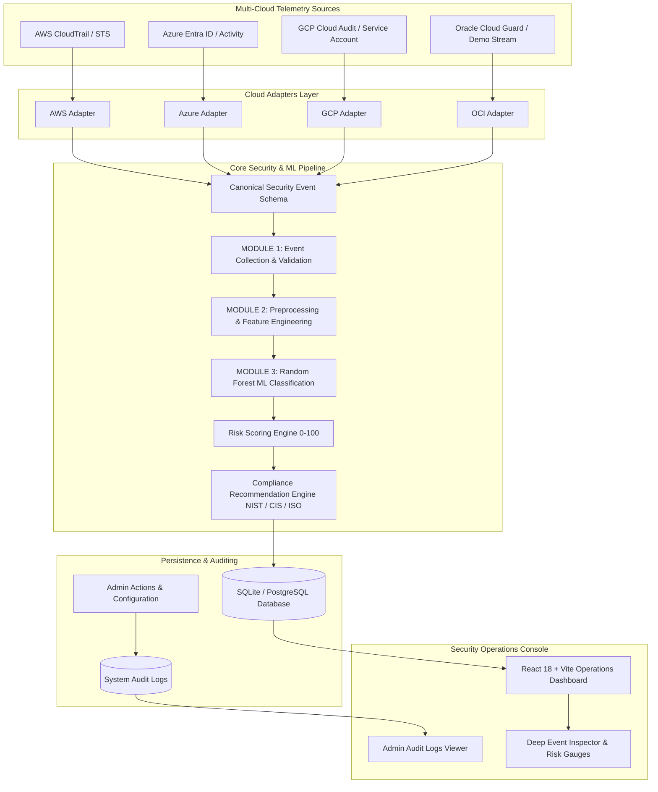

# 02. System Architecture

## 1. High-Level Architecture

The framework is structured into a modular, decoupled pipeline where provider-specific cloud telemetry is collected, normalized, validated, engineered into feature vectors, classified by machine learning, scored for risk, mapped to compliance frameworks, and rendered on the SOC console.

---

## 2. Architectural Layers

### 2.1 Cloud Adapters Layer (`backend/app/adapters/`)
All cloud integrations implement the abstract interface `BaseCloudAdapter`:
- `connect()`: Establishes read-only session.
- `validate_credentials()`: Tests authentication without leaking secret tokens.
- `get_connection_status()`: Returns connection metrics.
- `collect_events()`: Fetches raw audit records.
- `normalize_event()`: Translates proprietary schemas into the Canonical Event Schema.

### 2.2 Canonical Event Schema
A unified Pydantic model enforcing 10 standardized fields across all clouds:
`event_id`, `timestamp`, `cloud_provider`, `user_id`, `event_type`, `ip_address`, `location`, `failed_attempts`, `resource`, `request_frequency`.

### 2.3 Machine Learning & Risk Layer (`backend/app/modules/`)
- **Module 1**: Pydantic schema validation & batch error isolation.
- **Module 2**: Multi-cloud asset mapping, sensitive keyword parsing, anomalous geo detection, producing a 6-feature vector.
- **Module 3**: Random Forest Classifier evaluating threat class (`normal`, `brute_force`, `unauthorized_access`) and confidence probability.
- **Risk Engine**: Calculates integer score (0–100) and maps severity (`LOW`, `MEDIUM`, `HIGH`, `CRITICAL`).
- **Compliance Engine**: Generates mitigation steps mapped to NIST CSF 2.0, CIS Controls v8, and ISO/IEC 27001:2022.

### 2.4 Persistence & Auditing Layer (`backend/app/db.py`)
- `SecurityAlert`: Stores normalized events, ML labels, confidence, risk score, severity, reasons, and compliance recommendations.
- `UserProfile`: Role-based access control (`ADMIN`, `ANALYST`, `USER`) and tier flags (`is_pro`).
- `AuditLog`: System administration audit trail.

### 2.5 Security Operations Console (`frontend/src/`)
- Real-time React dashboard with Top Metrics Ribbon, Multi-Cloud Status Cards, Live Event Stream, 1-Click Presentation Scenarios, and Deep Event Inspector.
