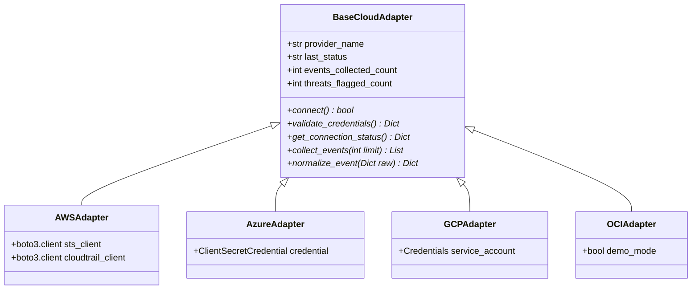

# 06. Multi-Cloud Architecture and Adapter Pattern

## Purpose
This document describes the design of the cloud adapters layer, the `BaseCloudAdapter` interface, and the lifecycle status engine for multi-cloud integrations.

---

## 1. Adapter Design Pattern

The platform uses the Adapter Pattern to isolate cloud provider specifics from the core validation and machine learning pipeline.

---

## 2. Adapter State Machine

Each cloud adapter operates within one of four well-defined lifecycle states:

| Status Value | Meaning | Pipeline Behavior |
| :--- | :--- | :--- |
| `CONNECTED` | Authentication succeeded and identity verified. | Ingests live telemetry from cloud provider APIs. |
| `DEMO MODE` | Provider configured in simulation mode. | Ingests verified deterministic event streams through the ML pipeline. |
| `NOT CONFIGURED` | Required credentials or environment variables missing. | Displays unconfigured status in UI; does not block other adapters. |
| `FAILED` | Authentication error or network exception. | Catches error, isolates provider, and records failure in diagnostic logs. |

---

## 3. Status Aggregation

The adapter registry (`backend/app/adapters/__init__.py`) exposes `get_multi_cloud_status(refresh=False)`. This function queries all registered adapters, builds a sanitized status summary, and returns it to the API layer without exposing private keys, secret strings, or tokens.
