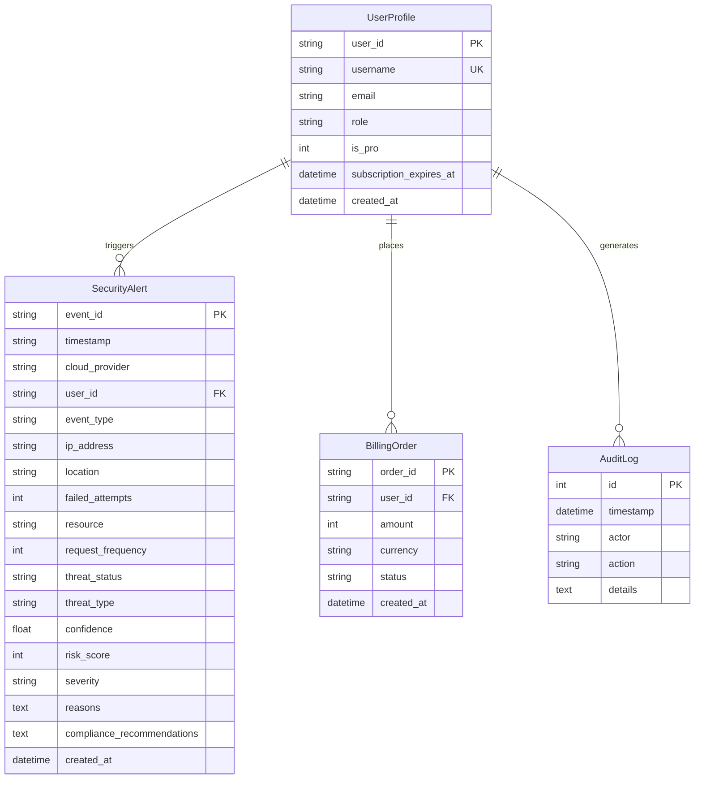

# 19. Database Architecture and Schema Reference

## Purpose
This document specifies the SQLAlchemy ORM models, table relationships, and automated SQLite migration logic implemented in `backend/app/db.py`.

---

## 1. Entity Relationship Diagram

---

## 2. Table Definitions

### 2.1 `security_alerts`
Stores processed security events, classification outputs, risk scores, and compliance advice.
- `event_id`: String primary key.
- `risk_score`: Integer (0 to 100).
- `severity`: String (`LOW`, `MEDIUM`, `HIGH`, `CRITICAL`).
- `compliance_recommendations`: Serialized JSON storing actionable remediation text and framework control IDs.

### 2.2 `users`
Manages user accounts, roles, and tier levels.
- `user_id`: Primary key (`usr_admin`, `usr_pro`, `usr_free`).
- `role`: String (`ADMIN`, `ANALYST`, `USER`).
- `is_pro`: Integer flag (`0` for Free, `1` for Pro).

### 2.3 `audit_logs`
Records administrative actions, cloud sync events, model retraining triggers, and subscription changes.

---

## 3. Automated SQLite Migration Engine

The `migrate_db()` function inspects existing SQLite table schemas using `PRAGMA table_info(security_alerts)` on startup. If columns such as `risk_score`, `severity`, or `compliance_recommendations` are missing from an older database file, the helper applies `ALTER TABLE` statements automatically without data loss.
