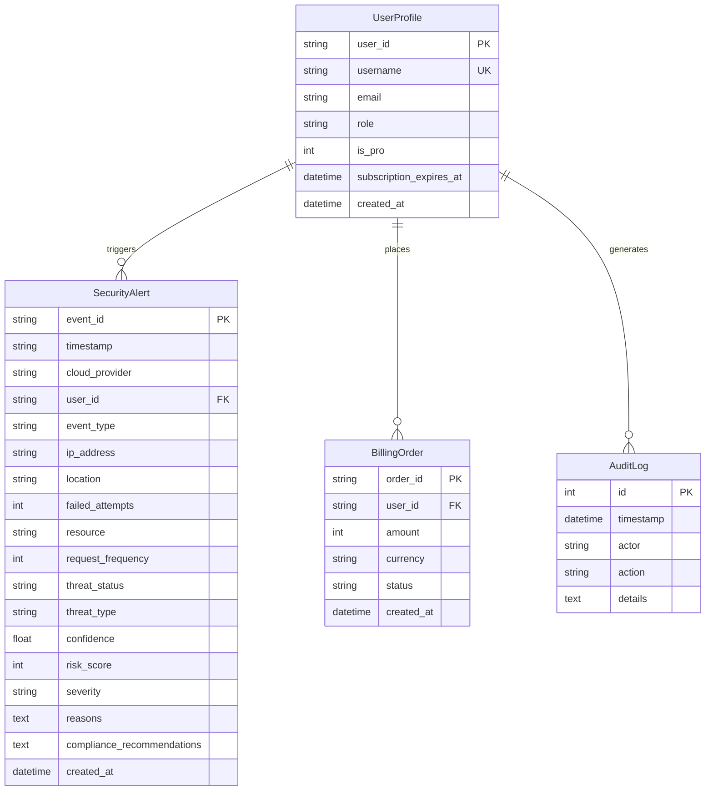

# 19. Database Architecture & Schema Reference

The database layer is managed via SQLAlchemy ORM in `backend/app/db.py`, supporting local SQLite and production PostgreSQL.

---

## 1. Entity Relationship Overview

---

## 2. Table Specifications

### 2.1 `security_alerts`
Stores fully processed security telemetry, classifier output, risk score, and compliance mapping.
- `event_id` (PK): Unique identifier.
- `risk_score`: Integer (0–100).
- `severity`: String (`LOW`, `MEDIUM`, `HIGH`, `CRITICAL`).
- `compliance_recommendations`: Serialized JSON storing actionable recommendations and framework mappings.

### 2.2 `users`
Manages user accounts, roles, and tier levels.
- `user_id` (PK): Identifier (`usr_admin`, `usr_pro`, `usr_free`).
- `role`: Access level (`ADMIN`, `ANALYST`, `USER`).
- `is_pro`: Binary tier flag (`0` for Free, `1` for Pro).

### 2.3 `audit_logs`
Immutable record of administrative actions, cloud sync events, model retraining runs, and subscription changes.

---

## 3. Automated SQLite Migration Engine

The `migrate_db()` helper dynamically inspects SQLite table columns using `PRAGMA table_info(security_alerts)` and automatically applies missing schema columns (`risk_score`, `severity`, `compliance_recommendations`, `created_at`) on startup without data loss.
