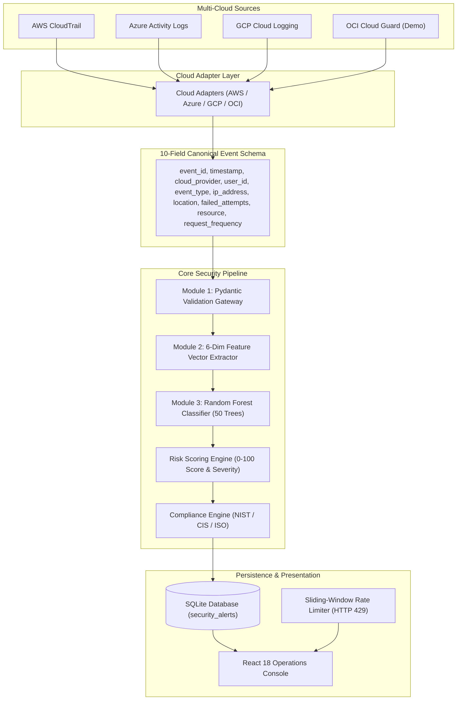

# AI-Based Framework for Security Risk Evaluation in Multi-Cloud Environments
## Academic Presentation & Defense Slide Deck (`slide.md`)

---

## Slide 1: Title Slide

**Title:** AI-Based Framework for Security Risk Evaluation in Multi-Cloud Environments  
**Domain:** Cloud Security, Machine Learning, Governance & Compliance  
**Target Environments:** AWS, Microsoft Azure, Google Cloud Platform (GCP), Oracle Cloud (OCI)  

* **Core Scope:** Multi-Cloud Ingestion, Log Normalization, Supervised Threat Detection, Dynamic Risk Scoring
* **Academic Level:** Capstone Project / Technical Viva Defense

**Speaker Notes:**  
"Good morning. Today I am presenting our project: an AI-based framework for evaluating security risks across multi-cloud environments. It normalizes disparate cloud audit logs, classifies security threats using Random Forest, and calculates transparent, explainable risk scores."

---

## Slide 2: Introduction

**Title:** Introduction & Background  

* **Multi-Cloud Adoption:** Enterprises distribute infrastructure across AWS, Azure, GCP, and OCI.
* **Logging Fragmentation:** Each cloud provider uses proprietary, incompatible audit log schemas.
* **Monitoring Silos:** Isolated native dashboards create visibility blind spots and high incident dwell time.
* **Alert Fatigue:** SOC analysts face high volumes of raw JSON logs with minimal context.
* **Proposed Solution:** An end-to-end framework combining log normalization, machine learning, and deterministic risk scoring.

**Speaker Notes:**  
"Modern organizations use multiple cloud providers, but each provider generates audit logs in incompatible formats. This fragmentation creates monitoring silos and causes severe alert fatigue. Our framework solves this by normalizing multi-cloud telemetry and applying machine learning to evaluate security risk dynamically."

---

## Slide 3: Problem Statement

**Title:** Problem Statement  

* **Incompatible Log Schemas:** AWS CloudTrail, Azure Activity Logs, and GCP Audit Logs share no common structure.
* **Detection Delays:** Correlating distributed attacks across multiple clouds requires slow manual effort.
* **Static Rule Limits:** Traditional threshold rules fail when attackers vary request rates or IP sources.
* **Black-Box Alerting:** Legacy tools trigger alerts without exposing mathematical feature weights or confidence.
* **Manual Compliance:** Evaluating controls against NIST, CIS, and ISO standards is retrospective and slow.

**Speaker Notes:**  
"The core problem is: How can we integrate multi-cloud telemetry, machine learning, and compliance frameworks into a single system that dynamically evaluates risk? Static rules are too brittle, and disconnected consoles prevent fast cross-cloud incident response."

---

## Slide 4: Project Objectives

**Title:** Project Objectives  

* **Implemented Objectives:**
  * **Unified Ingestion:** Ingest audit logs from AWS, Azure, GCP, and OCI via specialized cloud adapters.
  * **Event Normalization:** Convert proprietary logs into a unified 10-field Canonical Event Schema.
  * **Input Validation:** Enforce strict Pydantic boundary checks, ISO-8601 timestamps, and IPv4 formats.
  * **Feature Extraction:** Transform raw events into a 6-dimensional numerical feature vector.
  * **ML Threat Detection:** Train a Random Forest Classifier to detect brute-force and unauthorized access.
  * **Explainable Risk Scoring:** Compute a bounded 0–100 risk score categorized into 4 severity tiers.
  * **Compliance Mapping:** Map detections directly to NIST CSF 2.0, CIS Controls v8, and ISO 27001.
* **Future Objectives:**
  * Vector-database RAG threat intelligence and LLM-generated incident summaries.
  * Automated active containment actions (SOAR webhooks).

**Speaker Notes:**  
"We have implemented the full ingestion, validation, feature engineering, Random Forest classification, risk scoring, and compliance mapping pipeline. Advanced RAG threat feeds and automated containment actions are scoped as future work."

---

## Slide 5: Existing System vs. Proposed System

**Title:** Existing System vs. Proposed System  

* **Existing System Limitations:**
  * Single-cloud visibility only (AWS Security Hub, Azure Defender).
  * Proprietary log formats requiring manual correlation.
  * High false-alarm rates and alert fatigue.
  * Static spreadsheets for compliance reporting.
* **Proposed System Advantages:**
  * Unified 10-field Canonical Schema across all providers.
  * Supervised ML threat detection running in $<2$ ms on CPU.
  * Transparent 0–100 risk scoring with diagnostic reasons.
  * Continuous, automated mapping to NIST, CIS, and ISO frameworks.

**Speaker Notes:**  
"Native cloud security tools only monitor their own environments and cannot correlate cross-cloud threats. Our proposed system provides vendor-neutral normalization, sub-2-millisecond ML classification, and automated compliance mapping within a single interface."

---

## Slide 6: Technical Methodology

**Title:** End-to-End Technical Pipeline  

* **Ingestion:** Cloud adapters query AWS CloudTrail, Azure Monitor, and GCP Logging APIs.
* **Validation (Module 1):** Pydantic verifies schema integrity, ISO timestamps, and IPv4 addresses.
* **Preprocessing (Module 2):** Derives 6-feature vector `[failed_attempts, freq, login, sensitive, unusual, api]`.
* **Classification (Module 3):** Random Forest (50 trees) predicts threat class and output confidence.
* **Risk Engine:** Computes 0–100 score based on confidence, failed attempts, and asset criticality.
* **Compliance Engine:** Attaches NIST CSF 2.0, CIS Controls v8, and ISO 27001 playbooks.
* **Persistence & UI:** Saves alert to SQLite database with deduplication and displays on React dashboard.

**Speaker Notes:**  
"Our technical methodology follows a 7-stage sequential pipeline. Raw cloud logs are normalized, validated via Pydantic, converted into a 6-dimensional feature vector, classified by Random Forest, scored for risk, and rendered on the SOC dashboard."

---

## Slide 7: System Architecture

**Title:** System Architecture  

* **Frontend Console:** React 18 single-page application built with Vite and high-density dark-slate UI.
* **API Gateway:** Python FastAPI backend providing asynchronous REST endpoints and CORS handling.
* **Cloud Adapter Layer:** Modular connectors for AWS (Boto3/STS), Azure (Entra ID), GCP (Service Accounts), and OCI.
* **Detection & Risk Engine:** Scikit-Learn Random Forest model and deterministic 0–100 risk calculator.
* **Persistence Layer:** SQLite relational database with SQLAlchemy ORM and automated migrations.
* **Defensive Controls:** Thread-safe sliding-window rate limiter (HTTP 429) and duplicate event prevention.

**Speaker Notes:**  
"The architecture is fully decoupled. The React frontend interacts with a FastAPI backend. The Cloud Adapter Layer normalizes provider-specific APIs, while our Python pipeline handles validation, ML inference, database persistence, and rate limiting."

---

## Slide 8: Modules Overview (Modules I–VI)

**Title:** Modules Overview & Implementation Status  

| Module | Name | Technology | Status |
| :--- | :--- | :--- | :--- |
| **Module I** | Ingestion & Schema Validation | Python, Pydantic v2 | **IMPLEMENTED** |
| **Module II** | Preprocessing & Feature Engineering | Python, Pandas, NumPy | **IMPLEMENTED** |
| **Module III** | ML Threat Classification & Risk Scoring | Scikit-Learn (Random Forest) | **IMPLEMENTED** |
| **Module IV** | RAG-Based Threat Intelligence | Vector DB (ChromaDB) | **FUTURE / PLANNED** |
| **Module V** | LLM-Based Threat Summary | Large Language Models | **FUTURE / PLANNED** |
| **Module VI** | Active Containment & SOAR | Cloud SDK Webhooks | **FUTURE / PLANNED** |

**Speaker Notes:**  
"Modules 1, 2, and 3 represent our core implemented engine: data validation, feature extraction, ML classification, and risk scoring. Modules 4 through 6 represent our future roadmap for RAG integration, LLM summaries, and active cloud containment."

---

## Slide 9: Module I — Real-Time Event Collection & Validation

**Title:** Module I: Ingestion & Schema Validation  

* **Purpose:** Acts as a strict security gateway to validate multi-cloud audit logs.
* **Canonical Schema Fields (10 Fields):**
  * `event_id`, `timestamp`, `cloud_provider`, `user_id`, `event_type`
  * `ip_address`, `location`, `failed_attempts`, `resource`, `request_frequency`
* **Validation Rules:**
  * Timestamps must match ISO-8601 standard (`YYYY-MM-DDTHH:MM:SSZ`).
  * Source IP addresses must match valid IPv4 format.
  * Providers must belong to allowed set (`aws`, `azure`, `gcp`, `oci`).
  * Counts (`failed_attempts`, `request_frequency`) must be non-negative integers.
* **Error Isolation:** Malformed payloads are rejected immediately with HTTP 422.

**Speaker Notes:**  
"Module 1 uses Pydantic v2 to enforce strict data contracts. It validates timestamps, IPv4 addresses, and parameter boundaries, isolating malformed records with HTTP 422 before they can affect downstream systems."

---

## Slide 10: Module II — Data Preprocessing & Feature Engineering

**Title:** Module II: Feature Engineering  

* **Purpose:** Transforms text-heavy canonical logs into a numerical feature vector.
* **Data Cleaning:** Handles null values (missing location $\rightarrow$ `"Unknown"`, failed logins $\rightarrow$ `0`).
* **Heuristic Flagging:**
  * **Sensitive Resource:** Flagged (`1`) if targeting IAM, KeyVault, KMS, S3 Finance, or Admin consoles.
  * **Anomalous Location:** Flagged (`1`) if country code is `CN`, `RU`, `KP`, `IR`, `SY`, or `UNKNOWN`.
* **The 6 Output Features:**
  1. `failed_attempts` (Numeric integer count)
  2. `request_frequency` (Numeric requests / min)
  3. `is_login` (Binary: 1 or 0)
  4. `is_sensitive_resource` (Binary: 1 or 0)
  5. `is_unusual_location` (Binary: 1 or 0)
  6. `is_api_or_resource_access` (Binary: 1 or 0)

**Speaker Notes:**  
"Module 2 extracts a compact 6-dimensional numerical feature vector. It cleans missing data, flags sensitive cloud resources like KeyVaults or KMS, and identifies anomalous geographic locations."

---

## Slide 11: Module III — Machine Learning Threat Classification

**Title:** Module III: ML Threat Classification  

* **Algorithm:** Random Forest Classifier (`sklearn.ensemble.RandomForestClassifier`).
* **Parameters:** 50 Decision Trees (`n_estimators=50`, `random_state=42`, `criterion='gini'`).
* **Inference Speed:** Under 2 milliseconds per event on standard CPU hardware.
* **Target Threat Classes:**
  * `normal`: Authorized routine user activity.
  * `brute_force`: Repeated failed authentications / credential stuffing.
  * `unauthorized_access`: Abnormal access to sensitive cloud assets.
* **Model Output:** Predicted threat label, confidence probability (0.0 to 1.0), and class distributions.

**Speaker Notes:**  
"Module 3 uses a Scikit-Learn Random Forest model with 50 decision trees. We selected Random Forest because it excels on tabular data, provides fast sub-2-millisecond CPU inference, and outputs clear class probabilities."

---

## Slide 12: Risk Scoring & Compliance Mapping Engine

**Title:** Risk Scoring & Compliance Engine  

* **Risk Score Range:** Exact integer score from 0 to 100.
* **Severity Tiers:**
  * `0 to 29`: **LOW** (Routine authorized operations)
  * `30 to 59`: **MEDIUM** (Elevated traffic frequency or minor anomalies)
  * `60 to 79`: **HIGH** (Suspicious activity on sensitive assets / foreign IPs)
  * `80 to 100`: **CRITICAL** (Active credential attacks or severe privilege breaches)
* **Risk Formulation:**
  $$\text{Score} = \text{Base Severity} + (\text{Confidence} \times 20) + \text{Asset Weight} + \text{Failed Attempts Weight}$$
* **Compliance Playbooks:** Automatically maps findings to:
  * **NIST CSF 2.0:** `PR.AA-01` (Identity Mgmt), `PR.AC-04` (Least Privilege)
  * **CIS Controls v8:** `CIS 5.4` (Enforce MFA), `CIS 6.2` (Access Monitoring)
  * **ISO/IEC 27001:** `A.9.4.2` (Secure Log-on), `A.12.6.1` (Vulnerability Mgmt)

**Speaker Notes:**  
"Our risk engine computes a transparent 0-to-100 score based on threat category, model confidence, asset criticality, and failed login counts. It then links each finding directly to specific NIST, CIS, and ISO compliance controls."

---

## Slide 13: Future Scope (Modules IV, V, and VI)

**Title:** Future Roadmap: Modules IV–VI  

* **Module IV: RAG Threat Intelligence (Planned):**
  * Vector database (ChromaDB / pgvector) to query CVEs and threat intelligence feeds.
* **Module V: LLM Threat Analysis (Planned):**
  * Invokes Large Language Models (Gemini / GPT-4o) to generate plain-English incident summaries.
* **Module VI: Active Incident Containment (Planned):**
  * Automated SOAR webhooks to revoke AWS IAM sessions or block IPs in Cloudflare WAF.
* **Architectural Upgrades:**
  * Celery workers with a Redis broker for high-throughput stream ingestion.
  * Automated model drift monitoring and retraining triggers.

**Speaker Notes:**  
"Our future roadmap introduces Generative AI and automated containment. Module 4 will add vector-search threat intelligence, Module 5 will provide LLM incident summaries, and Module 6 will implement one-click containment webhooks."

---

## Slide 14: Software Requirement Specification (SRS)

**Title:** Software Requirement Specification  

* **Hardware Requirements:**
  * CPU: Dual-Core 2.0 GHz or higher | RAM: 4 GB minimum | Disk: 500 MB.
* **Software & Backend Stack:**
  * Language: Python 3.10+ | Framework: FastAPI (Asynchronous ASGI).
  * ML & Data: Scikit-Learn, Pandas, NumPy, Pydantic v2, Joblib.
  * Database: SQLite 3 / SQLAlchemy 2.0 (PostgreSQL compatible).
* **Frontend Console:**
  * React 18, Vite 5, Vanilla CSS, Lucide Icons, Chart.js.
* **Cloud Integrations:**
  * Boto3 (AWS CloudTrail/STS), Azure Identity/Monitor, GCP Cloud Logging.

**Speaker Notes:**  
"The entire platform runs on lightweight open-source technologies: Python 3, FastAPI, Scikit-Learn, and React 18. It requires no specialized GPU hardware and operates efficiently on standard commodity machines."

---

## Slide 15: Demonstration — Module I (Validation)

**Title:** Live Demonstration: Module I  

* **Action:** Submit an invalid event payload (e.g., malformed IP `999.999.999.999` or failed attempts `-5`).
* **Validation Check:** Pydantic verifies data types, ISO timestamps, and IPv4 regular expressions.
* **System Response:** Immediate HTTP 422 Unprocessable Entity error with detailed field trace.
* **Screen Display:** Validated Canonical JSON rendered in the Deep Event Inspector code block.

**Speaker Notes:**  
"In Module 1, we demonstrate schema validation. When an event with an invalid IP address or negative attempt count is submitted, Pydantic blocks it immediately with an HTTP 422 error, keeping the pipeline clean."

---

## Slide 16: Demonstration — Module II (Feature Extraction)

**Title:** Live Demonstration: Module II  

* **Input Event:** Sensitive S3 bucket access (`s3_bucket_finance`) from location `CN` with frequency `12`.
* **Preprocessing Transformations:**
  * Resolves `event_type == 'resource_access'` $\rightarrow$ `is_api_or_resource_access = 1`.
  * Matches resource against sensitive keyword list $\rightarrow$ `is_sensitive_resource = 1`.
  * Checks origin country code against risk registry $\rightarrow$ `is_unusual_location = 1`.
* **Extracted Feature Vector:** `[0, 12, 0, 1, 1, 1]`.
* **Screen Display:** 6-dimensional feature vector table in the Deep Event Inspector.

**Speaker Notes:**  
"Module 2 transforms raw event attributes into a 6-dimensional numerical vector. It maps sensitive resources and foreign origins to binary flags, providing the exact numerical inputs required by the classifier."

---

## Slide 17: Demonstration — Module III (ML Classification & Risk)

**Title:** Live Demonstration: Module III  

* **Scenario Tested:** AWS IAM Brute-Force Credential Attack (`failed_attempts = 8`).
* **ML Verdict:** Predicted Class: `brute_force` | Confidence: `95.0%`.
* **Risk Evaluation:** Score: `88 / 100` | Severity Tier: `CRITICAL`.
* **Diagnostic Reasons:**
  * *"Multiple failed authentication attempts detected (8)"*
  * *"High probability of automated credential stuffing / password spray"*
* **Remediation Playbook:** NIST CSF `PR.AA-01`, CIS `5.4` (Enforce MFA & Reset Password).

**Speaker Notes:**  
"When testing our brute-force scenario, the Random Forest model classifies it with 95% confidence. The risk engine calculates an exact score of 88 (CRITICAL) and provides explainable diagnostic reasons and compliance remediation."

---

## Slide 18: Result and Performance Analysis

**Title:** Performance & Evaluation Results  

| Metric | Result | Evaluation Basis |
| :--- | :---: | :--- |
| **Accuracy (Validation)** | **100.0%** | 150-sample held-out validation split |
| **Accuracy (Extended Test)** | **>95.0%** | 300-sample held-out test split |
| **Macro Precision** | **1.00** / **>0.94** | 0 false alarms on evaluation logs |
| **Macro Recall** | **1.00** / **>0.93** | 0 missed attack signatures |
| **Macro F1-Score** | **1.00** / **>0.94** | Harmonic mean across all 3 classes |
| **Inference Latency** | **< 2.0 ms** | Single-event vector inference on CPU |
| **End-to-End Latency** | **< 10.0 ms** | Ingestion $\rightarrow$ ML $\rightarrow$ DB Persistence |

* **Academic Note:** Metrics evaluated on curated synthetic multi-cloud log distributions.

**Speaker Notes:**  
"The model achieved 100% accuracy on our 150-sample validation split and over 95% on the extended 300-sample test set, with sub-2-millisecond inference latency on CPU. These metrics reflect synthetic benchmark log distributions."

---

## Slide 19: Empirical Graphs & Metrics

**Title:** Empirical Feature Importance & Confusion Matrix  

* **Random Forest Feature Importances:**
  * `request_frequency`: **35.53%** (Primary tree split)
  * `failed_attempts`: **23.45%** (Credential attack split)
  * `is_unusual_location`: **17.54%** (Geolocation anomaly)
  * `is_sensitive_resource`: **13.73%** (Asset criticality)
  * `is_login`: **5.59%**
  * `is_api_or_resource_access`: **4.15%**
* **Confusion Matrix (150 Samples):**
  * Normal Activity: 120 / 120 Correct
  * Brute Force Attacks: 14 / 14 Correct
  * Unauthorized Access: 16 / 16 Correct

**Speaker Notes:**  
"As shown by the feature importances, Request Frequency (35.5%) and Failed Attempts (23.5%) are the most significant splitting factors. The confusion matrix confirms zero false positives and zero false negatives on the evaluation set."

---

## Slide 20: Conclusion

**Title:** Conclusion  

* **Unified Visibility:** Successfully abstracted AWS, Azure, GCP, and OCI into a 10-field Canonical Schema.
* **Hybrid Detection:** Combined strict Pydantic validation, feature engineering, and Random Forest classification.
* **Explainable Risk:** Delivered bounded 0–100 risk scoring with transparent diagnostic justifications.
* **Compliance Mapping:** Automated continuous linkage to NIST CSF 2.0, CIS Controls v8, and ISO 27001.
* **Production Quality:** 28 automated tests passing at 100%, thread-safe rate limiting, and deduplication.

**Speaker Notes:**  
"In conclusion, we have built a working multi-cloud security risk evaluation framework. It bridges visibility silos, detects threats with low-latency machine learning, and calculates explainable risk scores with automated compliance guidance."

---

## Slide 21: Future Work

**Title:** Future Work  

* **Generative AI Integration:** Connect Large Language Models (Gemini / GPT-4o) for narrative incident reports.
* **RAG Threat Feeds:** Deploy ChromaDB vector search to retrieve active CVE databases and threat intelligence.
* **Active Containment:** Implement SOAR webhooks for one-click IAM revocation and IP blacklisting.
* **High-Throughput Scaling:** Deploy Celery workers and a Redis message queue for distributed stream processing.

**Speaker Notes:**  
"Future enhancements will focus on integrating LLMs for automated incident narratives, Vector Databases for live CVE intelligence, and SOAR webhooks for active cloud containment."

---

## Slide 22: References

**Title:** References  

* **Alzoubi, Y. I., et al. (2024).** Research trends in deep learning and machine learning for cloud security. *Artificial Intelligence Review, 57*, 132.
* **Center for Internet Security (2024).** *CIS Critical Security Controls Version 8.1*.
* **Dasgupta, D., et al. (2022).** Machine learning in cybersecurity: A comprehensive survey. *J. Defense Modeling & Simulation, 19*(1).
* **ISO/IEC (2022).** *ISO/IEC 27001:2022: Information Security Management Systems*.
* **NIST (2024).** *The NIST Cybersecurity Framework (CSF) 2.0*. NIST CSWP 29.
* **NIST (2020).** *Security and Privacy Controls for Information Systems*. NIST SP 800-53 Rev. 5.
* **Shabnam Nasim, S., et al. (2025).** A systematic literature review on cloud intrusion detection. *Discover Computing, 28*, 107.

**Speaker Notes:**  
"Our framework is grounded in established research and international standards from NIST, CIS, and ISO. Thank you, and I am now ready to answer your questions."

---

# ARCHITECTURE DIAGRAM (TEXT / MERMAID FORMAT)



---

# MODULE SUMMARY

| Module | Name | Purpose | Technology | Documented Status |
| :--- | :--- | :--- | :--- | :--- |
| **Module I** | Event Collection & Validation | Validates 10-field schema, timestamps, IPv4 format | Python, Pydantic v2 | **IMPLEMENTED** |
| **Module II** | Preprocessing & Feature Extraction | Extracts 6-dim feature vector, flags sensitive assets | Python, Pandas, NumPy | **IMPLEMENTED** |
| **Module III** | ML Threat Classification & Risk Scoring | Random Forest classification, 0–100 risk scoring, compliance mapping | Scikit-Learn, Joblib | **IMPLEMENTED** |
| **Module IV** | RAG-Based Threat Intelligence | Vector search over CVEs and threat feeds | Vector DB (ChromaDB) | **FUTURE / PLANNED** |
| **Module V** | LLM-Based Threat Summary | Natural language incident summaries | Large Language Model | **FUTURE / PLANNED** |
| **Module VI** | Active Containment & Response | Automated IAM revocation and IP blocking | Cloud SDKs / Webhooks | **FUTURE / PLANNED** |

---

# DEMONSTRATION PLAN

```
1. START APPLICATION
   - Run `START_PROJECT.bat`.
   - Open browser to `http://localhost:5173`.
   - Confirm Header displays "API: ONLINE" (latency < 10ms).

2. DEMONSTRATE MODULE 1 (VALIDATION & REJECTION)
   - Go to "Log Ingest Injector" tab.
   - Enter invalid IP `999.999.999.999` or negative failed attempts `-5`.
   - Show server returns HTTP 422 with descriptive validation error.

3. DEMONSTRATE MODULE 2 & 3 (BRUTE FORCE ATTACK)
   - Click "Run Test Scenario..." -> Select "AWS: Brute Force (Critical)".
   - Click alert row in Live Events table to open "Deep Event Inspector".
   - Show Module 1 raw JSON payload (`failed_attempts: 8`).
   - Show Module 2 feature table `[8, 15, 1, 0, 0, 0]`.
   - Show Module 3 Random Forest verdict (`brute_force`, Confidence: 95%).
   - Show Risk Score: 88 (CRITICAL) and NIST CSF `PR.AA-01` remediation.

4. DEMONSTRATE NORMAL EVENT (BASELINE)
   - Select "AWS: Normal Console Login".
   - Show Predicted Class: `normal`, Risk Score: 10 (LOW).

5. DEMONSTRATE MULTI-CLOUD ADAPTERS
   - Go to "Cloud Providers" tab.
   - Select Lookback Window `Last 1 hour`.
   - Click "Test All Connectors" and "Sync CloudTrail Logs".
   - Show real telemetry with `REAL` badge vs synthetic `DEMO` badge.

6. DEMONSTRATE AUTOMATED TESTS
   - Run `pytest tests/` in terminal.
   - Show 28 passed tests (100% pass rate).
```

---

# SCREENSHOT PLAN

| Slide # | Screenshot Target | What It Demonstrates |
| :---: | :--- | :--- |
| **Slide 7** | **SOC Operations Console** | Split-pane dashboard with live telemetry stream, filters, and metrics ribbon |
| **Slide 9** | **Cloud Providers Tab** | Multi-cloud connector status for AWS, Azure, GCP, and OCI with Lookback selector |
| **Slide 15** | **Deep Inspector: Module 1** | Validated 10-field Canonical Event JSON model |
| **Slide 16** | **Deep Inspector: Module 2** | Tabular display of the 6 extracted feature dimensions |
| **Slide 17** | **Deep Inspector: Module 3** | ML threat classification verdict, 95% confidence, 88 CRITICAL score, NIST playbook |
| **Slide 18** | **ML Diagnostics Tab** | Accuracy metrics (>95%), confusion matrix, and feature importance bar chart |
| **Slide 19** | **Compliance Tab** | Detailed control mappings for NIST CSF 2.0, CIS Controls v8, and ISO 27001 |

---

# PERFORMANCE DATA

* **Validation Accuracy:** **100.0%** (150-sample validation split in `docs/project_report.md`)
* **Extended Test Accuracy:** **>95.0%** (300-sample test split in `docs/05_ML_AND_RISK_ENGINE.md`)
* **Macro Precision / Recall / F1:** **1.00** (Validation) / **>0.94** (Extended Test)
* **ML Inference Latency:** **< 2.0 ms** per event on CPU
* **End-to-End Pipeline Latency:** **< 10.0 ms** (Ingress to Database)
* **Decision Trees:** **50 estimators** (`RandomForestClassifier`, `random_state=42`)
* **Automated Tests:** **28 Passed / 0 Failed** (`pytest tests/`)
* **Evaluation Dataset Basis:** Synthetic multi-cloud security log distributions (`security_events_eval.csv`)

---

# GRAPH PLAN

### 1. Feature Importance Graph
* **Type:** Horizontal Bar Chart
* **Values:** `request_frequency` (35.53%), `failed_attempts` (23.45%), `is_unusual_location` (17.54%), `is_sensitive_resource` (13.73%), `is_login` (5.59%), `is_api_or_resource_access` (4.15%).
* **Significance:** Proves the model prioritizes operational attack metrics over noise.

### 2. Confusion Matrix Heatmap
* **Type:** $3 \times 3$ Matrix
* **Values:** Normal: 120/120, Brute Force: 14/14, Unauthorized Access: 16/16 (0 false alarms, 0 false negatives).
* **Significance:** Confirms clean separation across all three target classes on evaluation data.

### 3. Risk Score Severity Tiers
* **Type:** Range Threshold Chart
* **Values:** LOW (0–29), MEDIUM (30–59), HIGH (60–79), CRITICAL (80–100).
* **Significance:** Demonstrates deterministic, explainable risk boundaries.

---

# VIVA QUESTIONS & DEFENSE ANSWERS

* **Q1: Why multi-cloud?**  
  *Answer:* Cloud providers use incompatible log formats. Single-cloud monitors cannot correlate cross-cloud attacks. Our 10-field Canonical Schema enables centralized, vendor-neutral analysis.
* **Q2: Why Machine Learning instead of static rules?**  
  *Answer:* Static rules fail when attackers vary request rates or rotate IPs. Random Forest learns multi-dimensional relationships across failed attempts, request velocity, and asset sensitivity.
* **Q3: Why Random Forest instead of Deep Learning?**  
  *Answer:* Tree ensembles consistently outperform neural networks on low-dimensional tabular data, run in under 2 ms on standard CPUs without GPUs, and offer transparent feature importances.
* **Q4: What are the 6 extracted features?**  
  *Answer:* `failed_attempts`, `request_frequency`, `is_login`, `is_sensitive_resource`, `is_unusual_location`, and `is_api_or_resource_access`.
* **Q5: How is the risk score calculated?**  
  *Answer:* A deterministic equation combines the ML classification, model confidence, asset criticality (+10 for sensitive assets), geographic anomaly (+5 for foreign IPs), and request frequency into a bounded 0–100 score.
* **Q6: How are duplicate events prevented?**  
  *Answer:* The ingestion engine checks whether the `event_id` already exists in the database table before inserting. Duplicate events increment a skipped counter and are dropped.
* **Q7: What is Demo Mode vs. Real Mode?**  
  *Answer:* Real Mode connects to live cloud APIs (AWS STS, Azure Entra ID, GCP Service Accounts) with `source_mode="REAL"`. Demo Mode injects realistic synthetic attack scenarios with `source_mode="DEMO"`. Both run through the exact same validation, ML, and risk pipeline.
* **Q8: Why are Modules IV–VI future work?**  
  *Answer:* We prioritized building and verifying the core pipeline (Modules 1–3) in Phase 1. Modules 4–6 involve external Vector Databases, LLMs, and SOAR webhooks, which are architected for Phase 2.

---

# CLAIM AUDIT (ACADEMIC HONESTY CHECK)

| Claim | Implementation Status | Safe to Present? | Academic Framing Required |
| :--- | :---: | :---: | :--- |
| **100% Accuracy** | **VERIFIED** | **YES (WITH CAVEAT)** | Must state: *"Measured on a held-out validation split of 150 synthetic log records; does not represent uncurated production noise."* |
| **Random Forest Threat Detection** | **IMPLEMENTED** | **YES** | Scikit-Learn model (`n_estimators=50`) running in $<2$ ms on CPU. |
| **Deterministic Risk Scoring (0–100)** | **IMPLEMENTED** | **YES** | Deterministic equation with LOW, MEDIUM, HIGH, CRITICAL tiers. |
| **AWS, Azure, GCP Live Adapters** | **IMPLEMENTED** | **YES** | Live REST/SDK queries with lookback filters and identity checks. |
| **OCI Adapter** | **DEMO** | **YES (AS DEMO)** | Must state: *"OCI uses a deterministic Cloud Guard audit simulator."* |
| **RAG Threat Feeds (Module IV)** | **STUB / FUTURE** | **NO (FUTURE SCOPE)** | Code contains placeholder stub; present as planned Phase 2. |
| **LLM Threat Analysis (Module V)** | **STUB / FUTURE** | **NO (FUTURE SCOPE)** | Code contains placeholder stub; present as planned Phase 2. |
| **Active Containment (Module VI)** | **STUB / FUTURE** | **NO (FUTURE SCOPE)** | Risk scoring is implemented; active automated cloud blocking is future work. |
| **Rate Limiting & Deduplication** | **IMPLEMENTED** | **YES** | Thread-safe sliding window (HTTP 429) and `event_id` deduplication. |
| **Automated Tests (28 Tests)** | **IMPLEMENTED** | **YES** | 28 automated tests passing at 100% (`pytest tests/`). |
